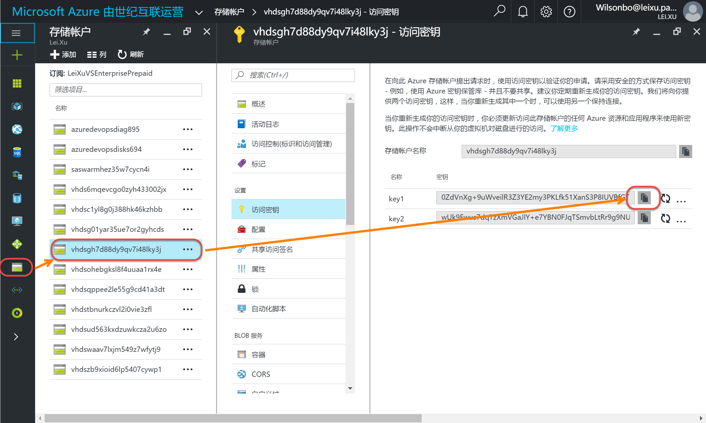

在Docker Host上使用Azure Storage部署Docker Registry
--------------------------------------------------------------

.. attention::
    
    文档内容将与Docker v1.12.1保持同步，请确保你所使用的Docker版本与本文档的适用范围一致，再参照本文档进行Docker的安装和配置，以防出现联系过程中系统不对称导致的问题。

登录Azure获取存储访问密钥
~~~~~~~~~~~~~~~~~~~~~~~~~~~~~~~~

点击 `这里<https://portal.azure.cn/>` 登录Azure门户。 登陆后查看存储信息，获取访问密钥。

使用azure story部署docker registry
~~~~~~~~~~~~~~~~~~~~~~~~~~~~~~~~~~~~~~~~~~~~~~~~
使用如下脚本创建批处理文件，在命令行工具中调用批处理文件：

.. code-block:: text

    docker run -d -p 5000:5000 ^
    -e REGISTRY_STORAGE=azure ^
    -e REGISTRY_STORAGE_AZURE_ACCOUNTNAME="vhdsgh7d88dy9qv7i48lky3j" ^
    -e REGISTRY_STORAGE_AZURE_ACCOUNTKEY="0ZdVnXg+9uWveilR3Z3YE2my3PKLfk51XanS3P8IUVBfGT1ATsm0wE9Yr7R+hgHl7EBHcfYuz5neimg2ofoECA==" ^
    -e REGISTRY_STORAGE_AZURE_CONTAINER="azureRegistry" ^
    -e REGISTRY_STORAGE_AZURE_REALM="core.chinacloudapi.cn" ^
    --name=registry ^
    --restart=always ^
    registry:2

运行结果：

.. figure:: create-docker-registry.png

