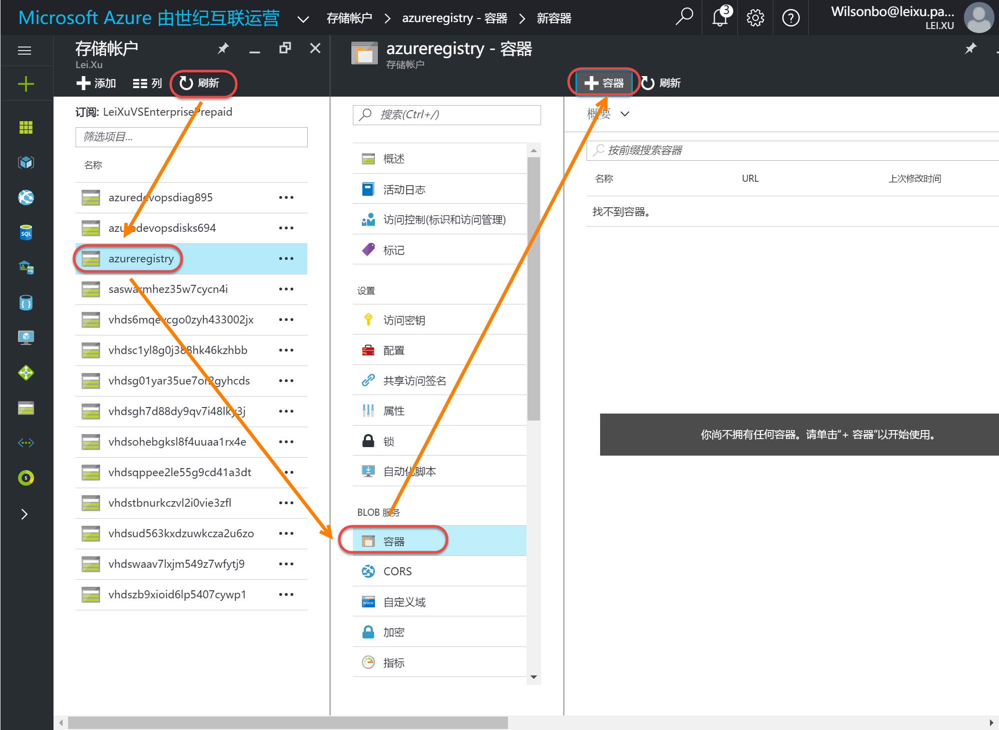
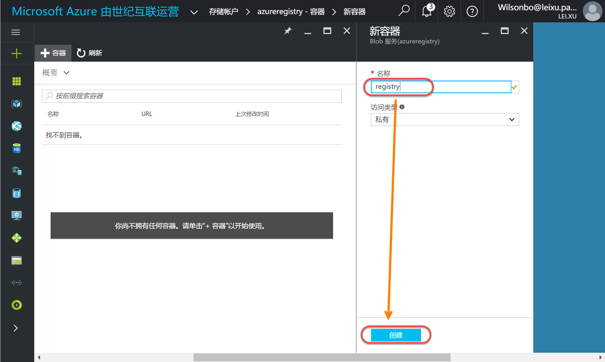

在Docker Host上使用Azure Storage部署Docker Registry
--------------------------------------------------------------

.. attention::
    
    文档内容将与Docker v1.12.1保持同步，请确保你所使用的Docker版本与本文档的适用范围一致，再参照本文档进行Docker的安装和配置，以防出现联系过程中系统不对称导致的问题。

在Azure中新建存储
~~~~~~~~~~~~~~~~~~~~~~~~~~~~~~~~

点击 `这里<https://portal.azure.cn/>` 登录Azure门户。 登陆后点击 **存储账户** | **添加**。

.. figure:: images/azure-create-storage.png

创建存储创建完毕后，点击新建存储账户添加容器。

请记录容器名称，我们下面创建registry时会用到。

登录Azure获取存储访问密钥
~~~~~~~~~~~~~~~~~~~~~~~~~~~~~~~~
添加完容器后，在当前新建存储账号中获取访问密钥。

.. figure:: images/azure-storage-key.png

创建本地Registry并将存储位置指向Azure Storage
~~~~~~~~~~~~~~~~~~~~~~~~~~~~~~~~~~~~~~~~~~~~~~~~
现在要在本地创建一个Registry服务，并设置实际image保存位置为刚才创建的Azure存储的容器中。这样我们通过调用docker push命令时会通过本地的registry将image推送到azure的存储容器中，这样更方便我们在azure的docker host上进行部署。使用如下脚本创建批处理文件，在命令行工具或者power shell中调用批处理文件：

.. code-block:: text

    docker run -d -p 5000:5000 ^
    -e REGISTRY_STORAGE=azure ^
    -e REGISTRY_STORAGE_AZURE_ACCOUNTNAME="{azure storage account name}" ^
    -e REGISTRY_STORAGE_AZURE_ACCOUNTKEY="{azure storage account key}" ^
    -e REGISTRY_STORAGE_AZURE_CONTAINER="{azure storage container name}" ^
    -e REGISTRY_STORAGE_AZURE_REALM="core.chinacloudapi.cn" ^
    --name=registry ^
    --restart=always ^
    registry:2

{azure storage account name}与{azure storage account key}参数可以在Azure存储账户的访问密钥界面获取。
{azure storage container name}参数是第一步创建的存储容器名称。

运行结果：

.. figure:: images/create-docker-registry.png

可以在本地调用docker ps命令查看已经启动的容器，稍后我们会将build出来的docker image放入这个容器中。

.. figure:: images/docker-ps.png

