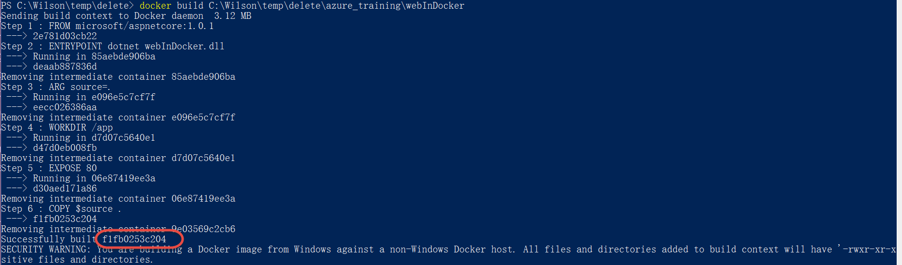
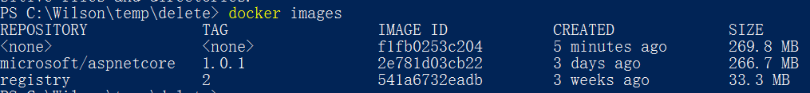
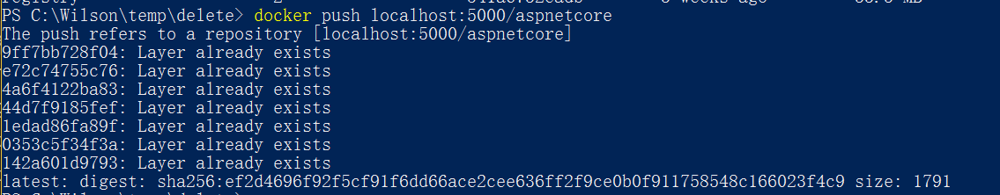
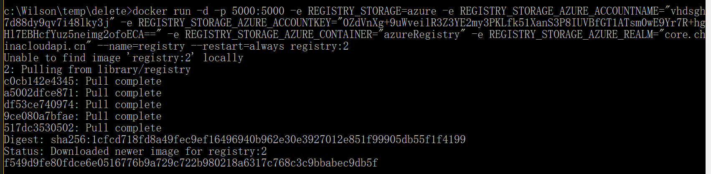
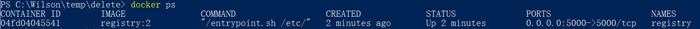

在Docker Host上使用Azure Storage部署Docker Registry
--------------------------------------------------------------

.. attention::
    
    文档内容将与Docker v1.12.1保持同步，请确保你所使用的Docker版本与本文档的适用范围一致，再参照本文档进行Docker的安装和配置，以防出现联系过程中系统不对称导致的问题。

使用Dockerfile生成docker image
~~~~~~~~~~~~~~~~~~~~~~~~~~~~~~~~
在本地运行Power shell， 运行如下命令创建 docker image：

.. code-block:: text

    docker build { 包含Dockerfile的文件夹地址 }

在之前的本地使用docker调试.net core web application中，我们已经使用vs的docker插件自动添加了.net core web application的docker支持文件，其中就包括了Dockerfile，可以在Visual Studio中查看详细内容。

命令运行结果：

docker image创建完成后，运行如下命令：

.. code-block:: text

    docker images

运行结果：

其中ID为f1fb0253c204的image就是上个步骤中使用docker build命令创建的image。
名称为registry的image是我们在本地部署registry时下载的registry image。
名称为microsoft/aspnetcore的image是一个依赖image，生成的.net core web application会包含这个image。

将Image推送到本地registry中
~~~~~~~~~~~~~~~~~~~~~~~~~~~~~~~~
创建image后为image打标记，以指定image的repository，这样可以通过repository的前缀指定将image上传到私有的registry中。运行命令如下：

.. code-block:: text

    docker tag {image id} localhost:5000/aspnetcore:latest

然后在运行 docker images命令，可以看到image的repository已经改为localhost:5000/aspnetcore，tag为latest。

现在运行docker push命令，将repository中的内容push到docker registry中，命令脚本如下：

.. code-block:: text

    docker push localhost:5000/aspnetcore

运行结果：

在Azure Docker Host运行上传的image
~~~~~~~~~~~~~~~~~~~~~~~~~~~~~~~~~~~~~~~~~~~~~~~~
现在要在Azure Docker Host上部署的registr中将本地上传的image拉取下来，首先依次运行如下脚本：

.. code-block:: text

    docker-machine ls
    docker-machine ssh {azure docker host name}
    docker pull 

运行结果：

可以在本地调用docker ps命令查看已经启动的容器，稍后我们会将build出来的docker image放入这个容器中。

