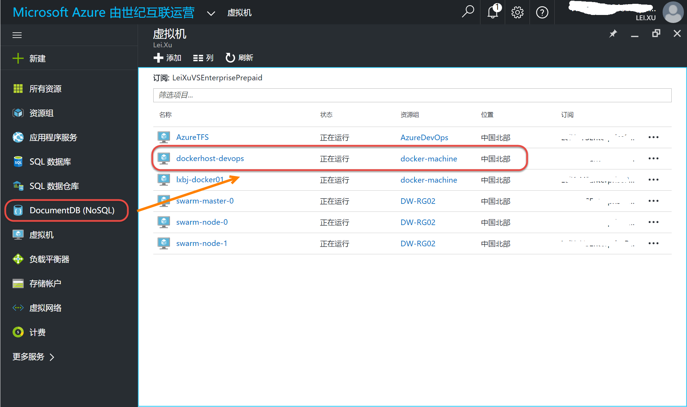

在Visual Studio中创建ASP.NET Core应用并使用docker调试
----------------------------------

.. attention::
    
    文档内容将与Docker v1.12.1保持同步，请确保你所使用的Docker版本与本文档的适用范围一致，再参照本文档进行Docker的安装和配置，以防出现联系过程中系统不对称导致的问题。

在Visual Studio中创建ASP.NET Core Web Application
~~~~~~~~~~~~~~~~~~~~~~~~~~~~~~~~

用户安装DotNetCore.1.0.1-VS2015Tools.Preview2.0.2程序后就可以在本地Visual Studio中创建ASP.NET Core Web应用了。

.. figure:: images/vs-create-project.png

.. figure:: images/vs-create-dotnet-core-web-app.png

.. figure:: images/vs-create-dotnet-core-web-app-wizard.png

运行网站
~~~~~~~~~~~~~~~~~~~~~~~~~~~~~~~~~~~~~~~~~~~~~~~~
创建完成后 Visual Studio 会自动运行dotnet restore命令恢复项目依赖，等待这一过程完成，然后按F5测试一下，正常情况下你可以看到以下初始的网站状态。

.. code-block:: text

    docker-machine create --driver azure --azure-environment "AzureChinaCloud" --azure-subscription-id {sub-id} --azure-open-port 80 --azure-location "ChinaNorth" {machine-name}

将命令中的{sub-id}替换成上个步骤中获取的订阅ID，{machine-name}替换为要在Azure中创建的Docker Host名称。
首次运行命令会让用户对本地进行Azure授权，在浏览器中打开命令行中提供的连接，使用使用账户登录后输入命令行最后提供的代码进行授权就可以了。

.. figure:: images/azure-authenticate.png

运行命令后可以在Azure的虚机列表页面中看到使用docker-machine命令在azure创建的主机。

同时在本地power shell中运行如下命令也能查看所有的的docker主机。

.. code-block:: text

    docker-machine ls

