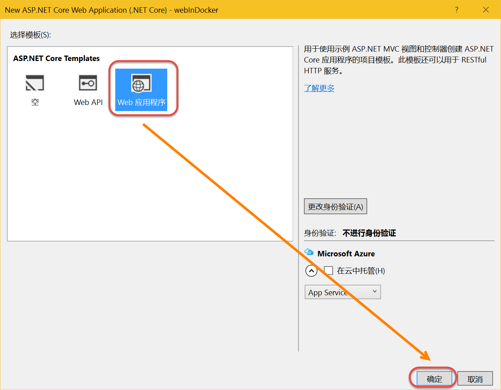

在Visual Studio中创建ASP.NET Core应用并使用docker调试
----------------------------------

.. attention::
    
    文档内容将与Docker v1.12.1保持同步，请确保你所使用的Docker版本与本文档的适用范围一致，再参照本文档进行Docker的安装和配置，以防出现联系过程中系统不对称导致的问题。

在Visual Studio中创建ASP.NET Core Web Application
~~~~~~~~~~~~~~~~~~~~~~~~~~~~~~~~

用户安装DotNetCore.1.0.1-VS2015Tools.Preview2.0.2程序后就可以在本地Visual Studio中创建ASP.NET Core Web应用了。

.. figure:: images/vs-create-project.png

.. figure:: images/vs-create-dotnet-core-web-app.png

运行网站
~~~~~~~~~~~~~~~~~~~~~~~~~~~~~~~~~~~~~~~~~~~~~~~~
创建完成后 Visual Studio 会自动运行dotnet restore命令恢复项目依赖，等待这一过程完成，然后按F5测试一下，正常情况下你可以看到以下初始的网站状态。

.. figure:: images/dotnet-core-default-webapp.png

创建Docker File
~~~~~~~~~~~~~~~~~~~~~~~~~~~~~~~~~~~~~~~~~~~~~~~~
安装DockerVSTools工具后，可以在.Net Core Web 应用上快速创建Docker File。

.. figure:: images/add-docker-support-corewebapp.png

插件会自动在你的项目中添加Docker的配置及打包文件，并且在你的Visual Studio的运行状态栏中多了一个 Docker 的选项，点击这个按钮或者F5，就可以将应用部署到本地的 Docker for Windows 环境，并开始调试了。

.. figure:: images/docker-in-vs.png
