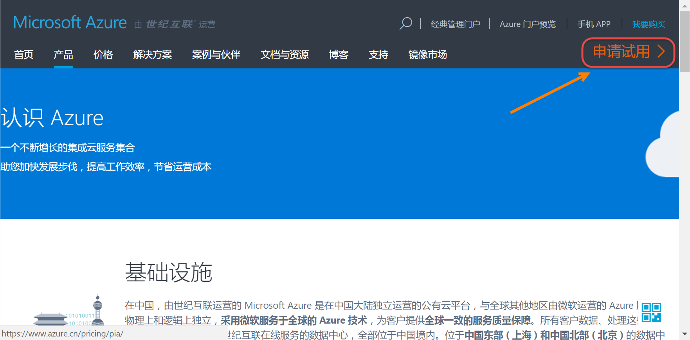

获取Azure账户
----------------------------------

.. attention::
    
    文档内容将与Docker保持同步，请确保你所使用的Docker版本与本文档的适用范围一致，再参照本文档进行Docker的安装和配置，以防出现联系过程中系统不对称导致的问题。

获取Azure账号
~~~~~~~~~~~~~~~~~~~~~~~~~~~~~~~~
可以通过购买微软的MSDN订阅账户、直接购买由世纪互联运营的Azure账户等形式获取正式使用账户。详细内容请点击这里 https://www.azure.cn/pricing/pia-waiting-list/?form-type=identityauth 。

同时Azure也提供了1元试用账户，用户可以通过访问 1元试用 https://www.azure.cn/pricing/1rmb-trial-full/?form-type=identityauth 获取试用账户，使用账户只提供受限的资源，详细了解相关内容请点击这里 https://www.azure.cn/offers/ms-mc-azr-44p/ 。

