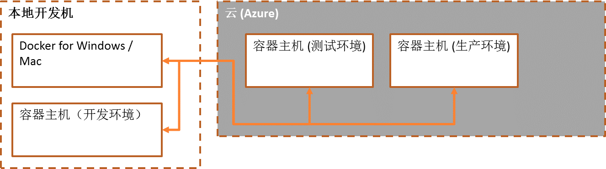
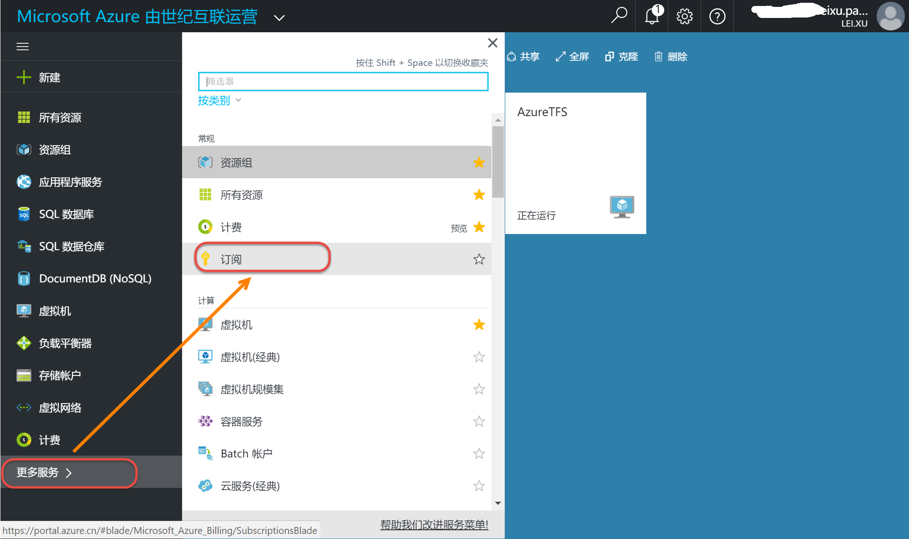

使用docker-machine在Azure中创建Docker Host
-------------------------------------------

.. attention::
    
    文档内容将与Docker v1.12.1保持同步，请确保你所使用的Docker版本与本文档的适用范围一致，再参照本文档进行Docker的安装和配置，以防出现联系过程中系统不对称导致的问题。

简介
~~~~~~~~~~

    - 在本地开发机直接管理Azure数据中心中的容器化主机
    - 自动完成TLS连接配置（SSH KEY配置）

登录Azure并获取Azure账户的Subscription Id
~~~~~~~~~~~~~~~~~~~~~~~~~~~~~~~~

点击这里 https://portal.azure.cn/ 登录Azure门户。 登陆后查看订阅信息。

.. figure:: images/azure-sub-id.png

在Azure中创建Docker Host
~~~~~~~~~~~~~~~~~~~~~~~~~~~~~~~~~~~~~~~~~~~~~~~~

在Power Shell中运行docker-machine命令，命令脚本如下：

.. code-block:: text

    docker-machine create --driver azure --azure-environment "AzureChinaCloud" --azure-subscription-id {sub-id} --azure-open-port 80 --azure-location "ChinaNorth" {machine-name}

将命令中的{sub-id}替换成上个步骤中获取的订阅ID，{machine-name}替换为要在Azure中创建的Docker Host名称。
首次运行命令会让用户对本地进行Azure授权，在浏览器中打开命令行中提供的连接，使用使用账户登录后输入命令行最后提供的代码进行授权就可以了。

.. figure:: images/azure-authenticate.png

运行命令后可以在Azure的虚机列表页面中看到使用docker-machine命令在azure创建的主机。

.. figure:: images/azure-vm-list.png

同时在本地power shell中运行如下命令也能查看所有的的docker主机。

.. code-block:: text

    docker-machine ls

