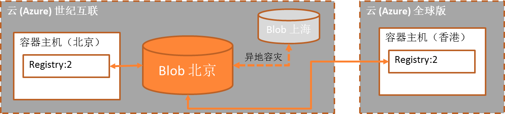
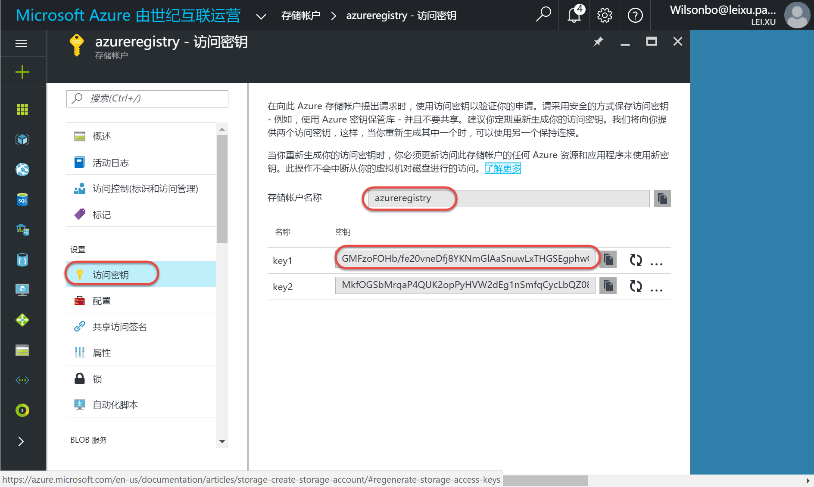
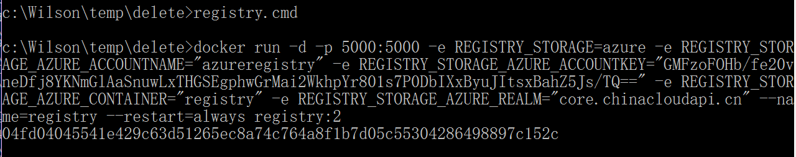
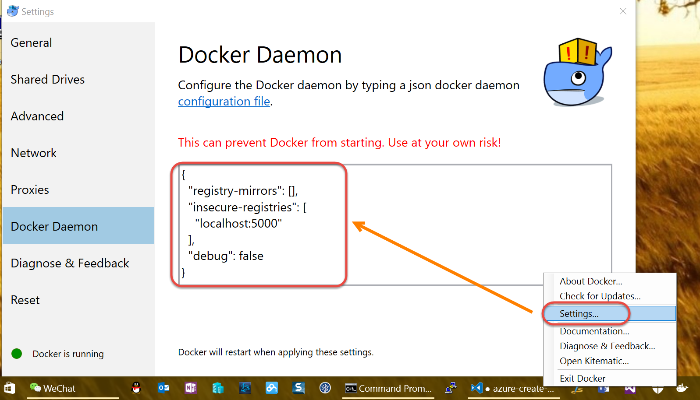

在Docker Host上使用Azure Storage部署Docker Registry
--------------------------------------------------------------

.. attention::
    
    文档内容将与Docker v1.12.1保持同步，请确保你所使用的Docker版本与本文档的适用范围一致，再参照本文档进行Docker的安装和配置，以防出现联系过程中系统不对称导致的问题。

私有Registry简介（基于Azure云存储）
~~~~~~~~~~~~~~~~~~~~~~~~~~~~~~~~~~~~

    - 使用Azure云存储作为仓库的后端数据存储，容器可以随时回收，数据被持久化，并可以使用异地容灾
    - 借助Azure全球数据中心之间的高速网络，在香港的容器主机中从 docker hub拉取镜像并为国内环境提供高速访问

在Azure中新建存储
~~~~~~~~~~~~~~~~~~~~~~~~~~~~~~~~

点击这里 https://portal.azure.cn/ 登录Azure门户。 登陆后点击 **存储账户** | **添加**。

.. figure:: images/azure-create-storage.png

创建存储创建完毕后，点击新建存储账户添加容器。

.. figure:: images/azure-create-storage-container.png

.. figure:: images/azure-create-storage-container-wizard.png

请记录容器名称，我们下面创建registry时会用到。

登录Azure获取存储访问密钥
~~~~~~~~~~~~~~~~~~~~~~~~~~~~~~~~

添加完容器后，在当前新建存储账号中获取访问密钥。

创建本地Registry并将存储位置指向Azure Storage
~~~~~~~~~~~~~~~~~~~~~~~~~~~~~~~~~~~~~~~~~~~~~~~~

现在要在本地创建一个Registry服务，并设置实际image保存位置为刚才创建的Azure存储的容器中。这样我们通过调用docker push命令时会通过本地的registry将image推送到azure的存储容器中。
使用如下脚本创建批处理文件，在命令行工具或者power shell中调用批处理文件：

.. code-block:: text

    docker run -d -p 5000:5000 ^
    -e REGISTRY_STORAGE=azure ^
    -e REGISTRY_STORAGE_AZURE_ACCOUNTNAME="{azure storage account name}" ^
    -e REGISTRY_STORAGE_AZURE_ACCOUNTKEY="{azure storage account key}" ^
    -e REGISTRY_STORAGE_AZURE_CONTAINER="{azure storage container name}" ^
    -e REGISTRY_STORAGE_AZURE_REALM="core.chinacloudapi.cn" ^
    --name=registry ^
    --restart=always ^
    registry:2

{azure storage account name}与{azure storage account key}参数可以在Azure存储账户的访问密钥界面获取。
{azure storage container name}参数是第一步创建的存储容器名称。

运行结果：

可以在本地调用docker ps命令查看已经启动的容器，稍后我们会将build出来的docker image放入这个容器中。

.. figure:: images/docker-ps.png

右键点击本地运行的docker程序，修改本地docker设置中的daemon：

daemon中的脚本如下：

.. code-block:: text

    {
        "registry-mirrors": [],
        "insecure-registries": [
            "localhost:5000"
        ],
        "debug": false
    }

创建Remote Registry并将存储位置指向Azure Storage
~~~~~~~~~~~~~~~~~~~~~~~~~~~~~~~~~~~~~~~~~~~~~~~~

现在要在上一个联系中在azure中创建docker host上创建一个Registry服务，并设置实际image保存位置为与上步相同Azure存储的容器中。这样我们可以在本地Build好image后push到本地的registry中，image实际保存在azure存储的容器中。由于azure的docker host上创建的registry同样将image存储位置指向到azure的同一个存储账号的容器中，因此可以在azure docker host中直接将本地上传的image拉取到本地。

首先调用如下脚本：

.. code-block:: text

    docker-machine ls

继续调用脚本使用ssh方式连接到azure docker host上，docker machine名称可以从上面的列表中获取：

.. code-block:: text

    docker-machine ssh {azure docker machine name}

结果如下：

.. figure:: images/docker-ssh-connect.png

创建shell脚本文件：

.. code-block:: text

    sudo touch registry.sh
    sudo chmod +x registry.sh
    sudo vi registry.sh

使用如下脚本创建sh文件：

.. code-block:: text

    docker run -d -p 5000:5000 \
    -e REGISTRY_STORAGE=azure \
    -e REGISTRY_STORAGE_AZURE_ACCOUNTNAME="{azure storage account name}" \
    -e REGISTRY_STORAGE_AZURE_ACCOUNTKEY="｛azure storage account key｝" \
    -e REGISTRY_STORAGE_AZURE_CONTAINER="{azure storage container name}" \
    -e REGISTRY_STORAGE_AZURE_REALM="core.chinacloudapi.cn" \
    --name=registry \
    --restart=always \
    registry:2

.. attention::
    
    在power shell中编辑文本文件操作比较麻烦， 具体操作步骤如下：
    - 运行sudo vi 后，按 **e**
    - 按 **a**, 这时power shell下方会有一个 **INSERT** 提示，如果没出现提示就再按 **a**
    - 复制上面 **编辑** 后的脚本， 每行脚本前面的空格一定要去掉
    - 右键点击power shell中的空白位置会将复制的脚本粘贴过去
    - 输入Ctrl + C
    - 输入Shift + w,q
    - 输入wq!

运行结果：

.. figure:: images/azure-docker-create-registry.png

调用docker ps命令查看已经启动的容器

