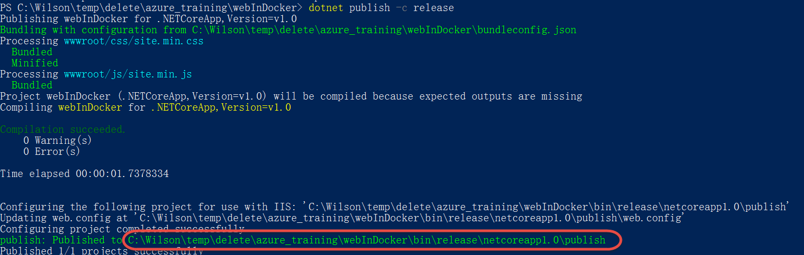
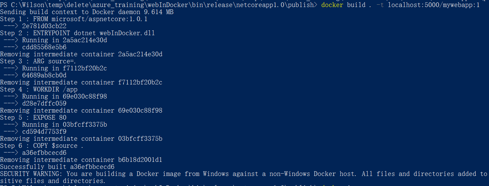
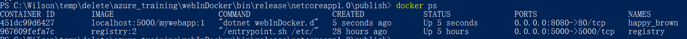
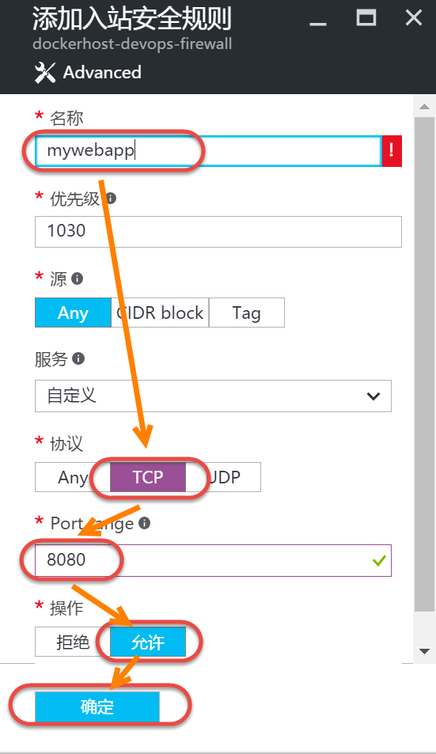

在Docker Host上使用Azure Storage部署Docker Registry
--------------------------------------------------------------

.. attention::
    
    文档内容将与Docker v1.12.1保持同步，请确保你所使用的Docker版本与本文档的适用范围一致，再参照本文档进行Docker的安装和配置，以防出现联系过程中系统不对称导致的问题。

使用Dockerfile生成docker image
~~~~~~~~~~~~~~~~~~~~~~~~~~~~~~~~

依次运行如下脚本发布样例.Net Core Web Application：

.. code-block:: text

    cd {.net core web application 项目目录}
    dotnet restore
    dotnet publish -c release

运行结果如下：

根据上图显示的publish目录，运行如下命令：

.. code-block:: text

    cd {publish 目录}
    docker build . -t localhost:5000/mywebapp:1.0

在之前的本地使用docker调试.net core web application中，我们已经使用vs的docker插件自动添加了.net core web application对docker的支持文件，其中就包括了Dockerfile，可以在Visual Studio中查看详细内容。

命令运行结果：

docker image创建完成后，运行如下命令：

.. code-block:: text

    docker images

运行结果：

.. figure:: images/docker-images.png

其中Repository为localhost:5000/mywebapp的image就是上个步骤中使用docker build命令创建的image。
名称为registry的image是我们在本地部署registry时下载的registry image。

将Image推送到本地registry中
~~~~~~~~~~~~~~~~~~~~~~~~~~~~~~~~

创建image后运行如下命令，将docker image推送到本地registry中：

.. code-block:: text

    docker push localhost:5000/mywebapp:1

运行结果：

.. figure:: images/docker-push-result.png

在Azure Docker Host运行上传的image
~~~~~~~~~~~~~~~~~~~~~~~~~~~~~~~~~~~~~~~~~~~~~~~~

现在要在Azure Docker Host上部署的registr中将本地上传的image拉取下来，首先依次运行如下脚本：

.. code-block:: text

    docker-machine ls
    docker-machine env {azure docker host name} | Invoke-Expression 
    docker pull 
    docker run -p 8080:80 localhost:5000/mywebapp:1 -d
    docker ps

调用docker ps命令查看已经启动的容器，其中就包含我们刚刚启动的docker容器。

在Azure上打开8080端口并在本地访问
~~~~~~~~~~~~~~~~~~~~~~~~~~~~~~~~~~~~~~~~~~~~~~~~

点击 `这里<https://portal.azure.cn/>` 登录Azure门户。 登陆后在所有资源中找到自己创建的docker host的firewall。

.. figure:: images/azure-docker-host-firewall.png

在本地打开浏览器访问 http://{docker host ip}:8080

