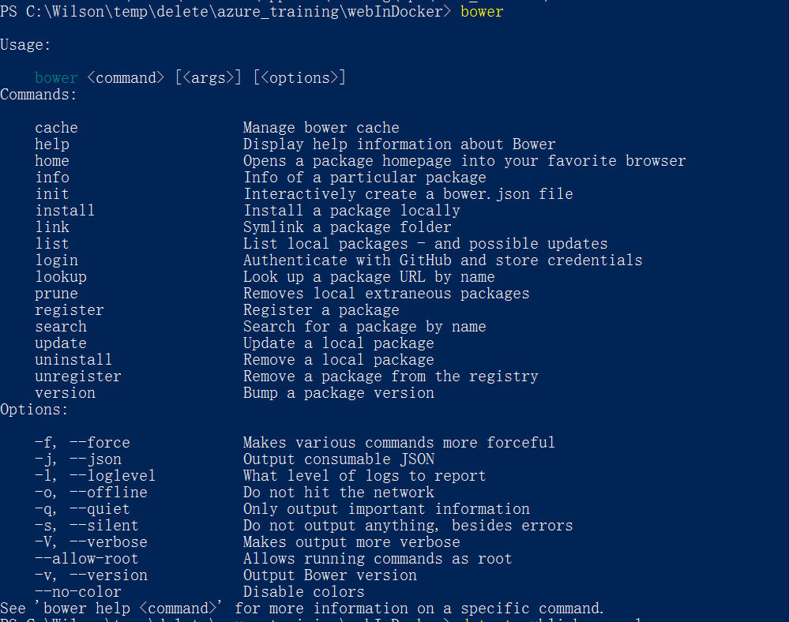

配置本地Visual Studio + Docker开发环境
----------------------------------

.. attention::
    
    文档内容将与Docker v1.12.1保持同步，请确保你所使用的Docker版本与本文档的适用范围一致，再参照本文档进行Docker的安装和配置，以防出现联系过程中系统不对称导致的问题。

    请点击这里 http://pan.baidu.com/s/1mhEIEr2 下载预装软件，密码：4qs6。

    文件列表：

    - cmder.zip
    - DockerVSTools.VS140.exe
    - DotNetCore.1.0.1-VS2015Tools.Preview2.0.2.exe
    - InstallDocker.msi
    - node-v4.6.0-x64.msi

安装Docker for Windows
~~~~~~~~~~~~~~~~~~~~~~~~~~~~~~~~

.. attention::
    
    安装前请确认：
    
        - 本地操作系统为Windows 10并安装了最新更新。
        - 已经安装Viusal Studio 2015

双击文件InstallDocker.msi启动Docker安装向导。安装后启动Docker，可以在右下角看到运行的Docker托盘程序。

.. figure:: images/docker-runner.png

安装DotNetCore.1.0.1-VS2015Tools
~~~~~~~~~~~~~~~~~~~~~~~~~~~~~~~~~~~~~~~~~~~~~~~~

确认Docker for Windows正确启动后安装DotNetCore.1.0.1-VS2015Tools.Preview2.0.2.exe。安装程序会自动安装.Net Core SDK。 

.. attention::
    
    需要跨域才能正确本安装本程序。

安装后能在Visual Studio 的项目创建向导中看到.Net Core的web应用项目类型。

.. figure:: images/vs-create-project.png

.. figure:: images/vs-dotnet-core-project-template.png

安装DockerVSTools
~~~~~~~~~~~~~~~~~~~~~~~~

确认安装DotNetCore.1.0.1-VS2015Tools后才能安装DockerVSTools。

双击安装程序，启动DockerVSTools.VS140.exe安装向导。

安装Node.js
~~~~~~~~~~~~~~~~~~~~~~~~

双击安装程序，启动node-v4.6.0-x64.msi安装向导，选择默认安装。

安装完成后依次运行如下命令：

.. code-block:: text

    npm install bower -g
    bower

运行bower命令后应该输出：

