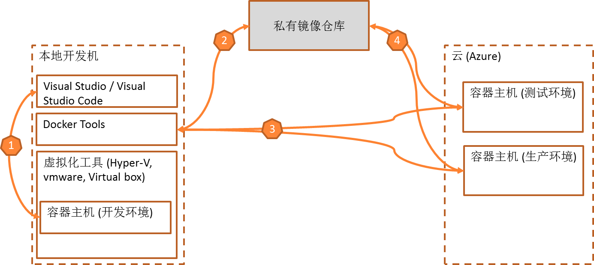

个人开发者或小团队: 使用Docker for Windows + Docker Machine 构建小型企业DevOps方案
==========================================================================================

.. |stub-icon| unicode:: U+1F527

.. attention::
    
    文档内容将与Docker v1.12.1保持同步，请确保你所使用的Docker版本与本文档的适用范围一致，再参照本文档进行Docker的安装和配置，以防出现联系过程中系统不对称导致的问题。
    
    
    本文档提供2个主要版本:
    
    - stable: 稳定版本
    - latest: 最新版本，持续更新。

个人开发者或小团队方案
----------------------------

    - 编码并使用本地容器环境进行调试
    - 使用本地Docker Tools构建容器镜像，并推送到私有仓库
    - 使用Docker Machine在Azure中创建容器主机
    - 部署容器到Azure中的容器主机

.. toctree::
   :titlesonly:

   config-local-environment
   debug-dotnet-core-webapp-in-docker
   azure-create-docker-host
   azure-create-docker-registry
   build-docker-image-push-deploy
   
   
