配置基于Docker Swarm的DevOps持续交付管道
------------------------

连接至VSTS/TFS团队项目
=====================

使用讲师所提供的账号，登录到 http://tfs.devopshub.cn:8080/tfs 

在服务器首页上点击 *浏览 | {团队项目名称} | 浏览* 进入你的团队项目

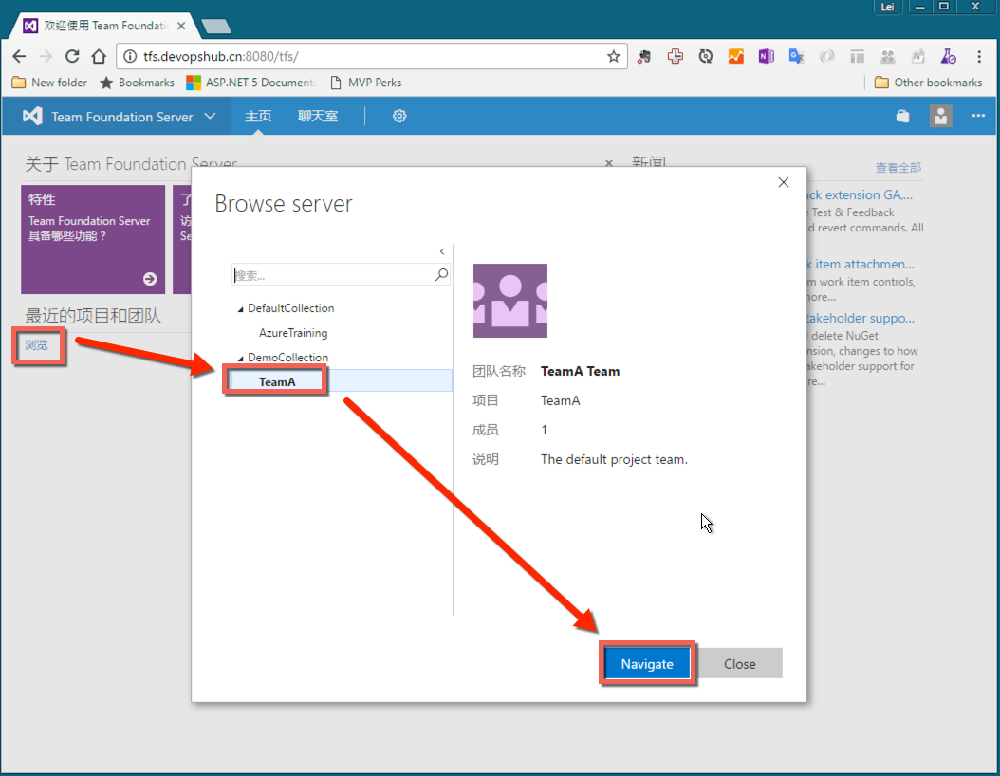

链接 Docker Swarm 集群到团队项目
=====================

在团队项目中，点击 *齿轮标志 | 服务* 进入服务配置页面

.. figure:: images/lab02-3-nav-service.png

在服务页面中，点击 *新建服务终结点 | ssh* 创建新的ssh服务器连接

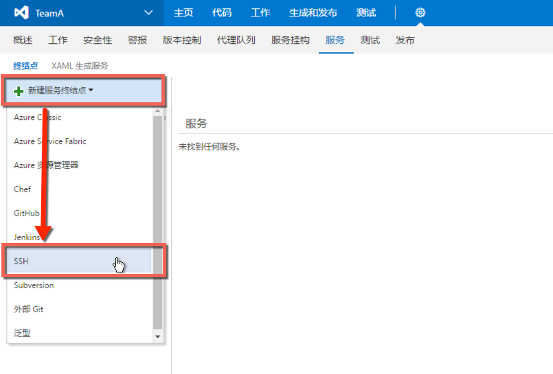

在添加ssh连接页面中，输入以下信息

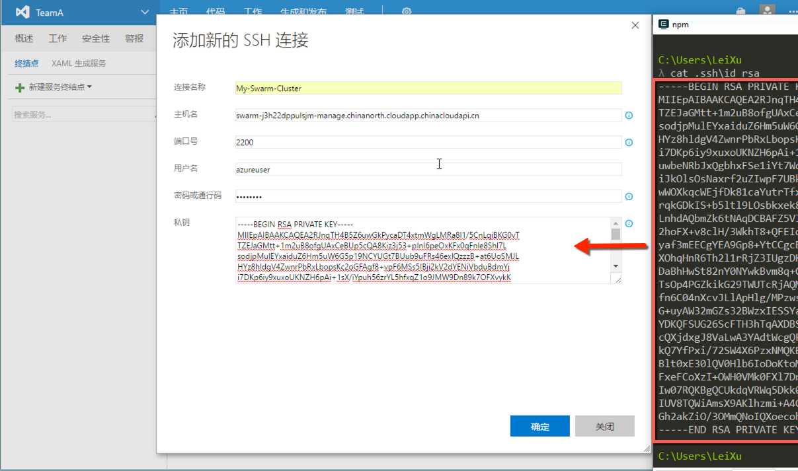

================    ===========
    参数              说明
================    ===========
连接名称              你给这个服务器连接所起的名称，将会显示在vsts/tfs中的其他配置页面中
主机名                你的swarm-master-0的dns地址，可以从Azure资源组的部署页面中获取
端口号                你的swarm-master-0通过负载均衡器所暴露的端口好，请修改为为2200
用户名                azureuser
密码                  随便输入（因为我们并不是用密码进行连接）
私钥                  通过 cat .ssh/id_rsa 获取你的私钥串，请复制所有内容
================    ===========

提交项目代码
=====================

打开Visual Studio并按照以下操作连接到团队项目

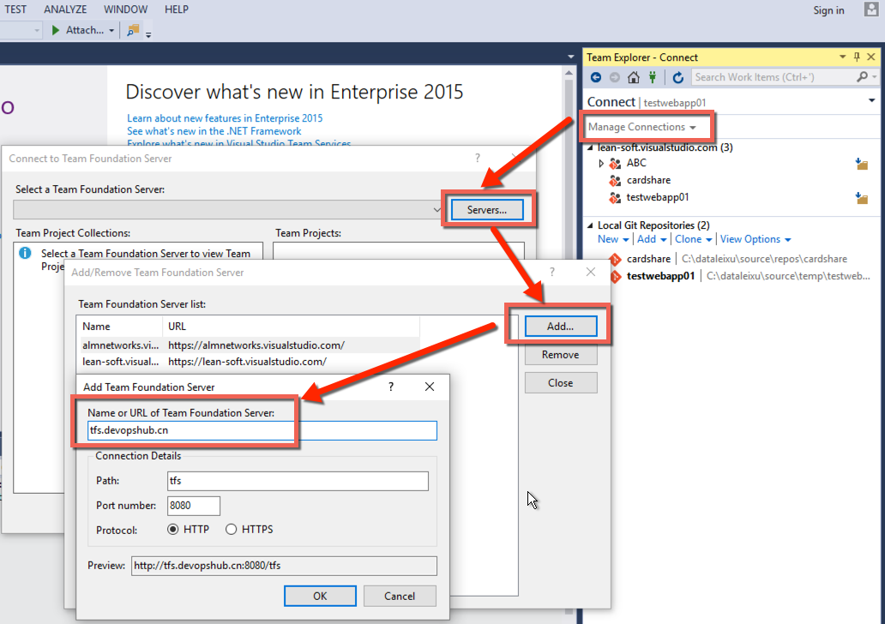

完成后选择你的团队项目并点击 *连接* 

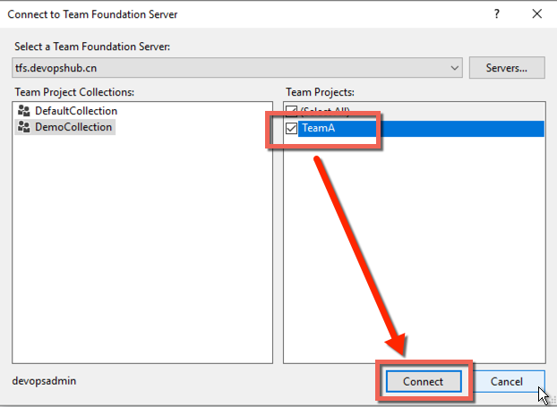

在团队资源管理器中点击 *克隆* 

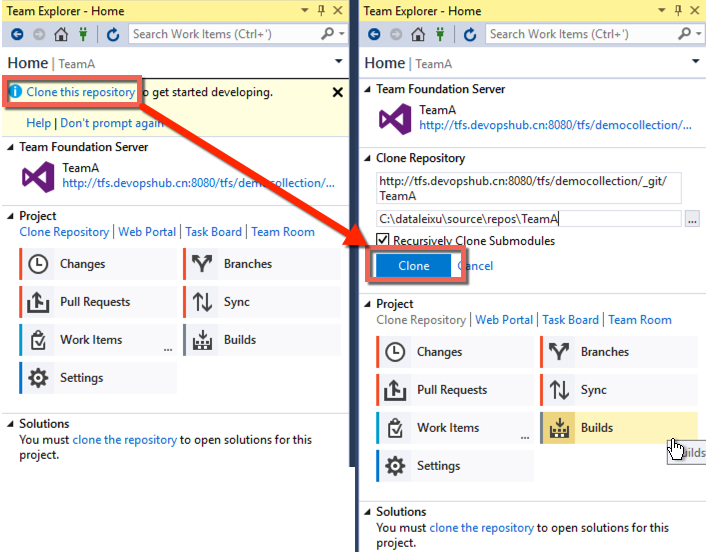

在团队资源管理器中点击 *新建* 创建新的asp.net core解决方案

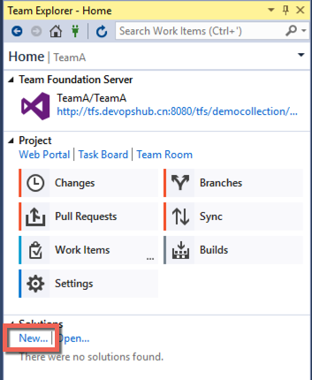

.. attention::

    请参考相关试验内容创建asp.net core解决方案并启用docker支持。

在你项目的根目录中添加 build.sh 文件，内容如下

.. code-block: bash

    #!bin/bash
    set -e
    dotnet restore
    rm -rf $(pwd)/publish
    dotnet publish src/{ 你的项目名称 }/project.json -c release -o $(pwd)/publish/web

.. attention::

    请注意替换 *{ 我的项目名称 }* 为你的项目名。
    请使用 *高级保存* 选项将以上文件保存为 Unix (LF)格式。

项目创建完成后，确保本地可以使用docker进行调试，按以下方式提交代码到tfs服务器

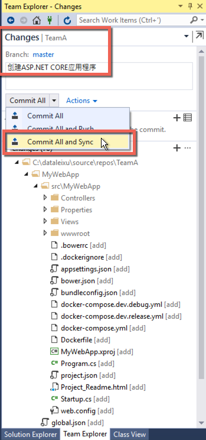

回到团队项目，导航到 *代码* 可以看到项目代码已经成功提交

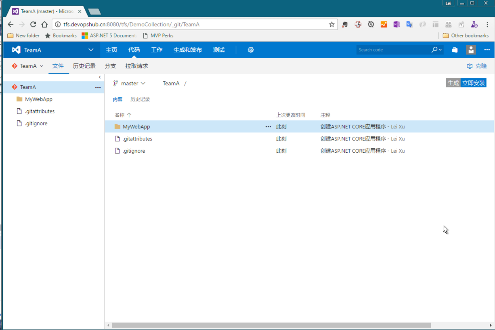

创建持续集成定义
=====================

点击 *生成和发布 | 生成* 进入生成配置页面

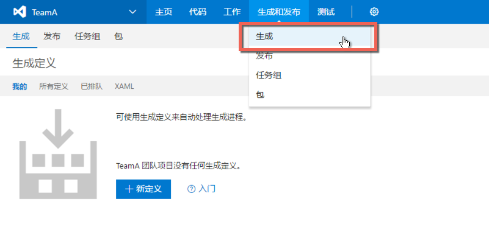

点击 *新定义* 按钮创建新的持续集成定义，在弹出的 *创建新的生成定义* 对话框中选择 *空模版* 并点击 *下一步*

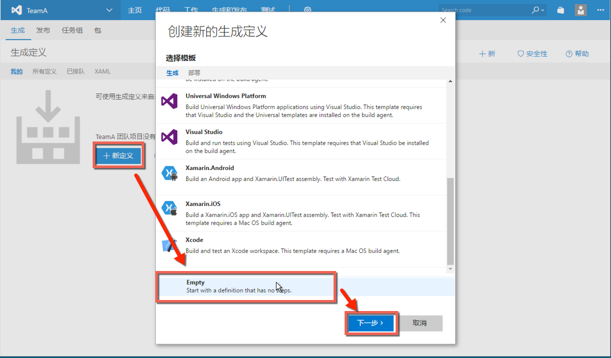

在 *设置存储裤* 页面中使用默认设置，点击 *创建* 

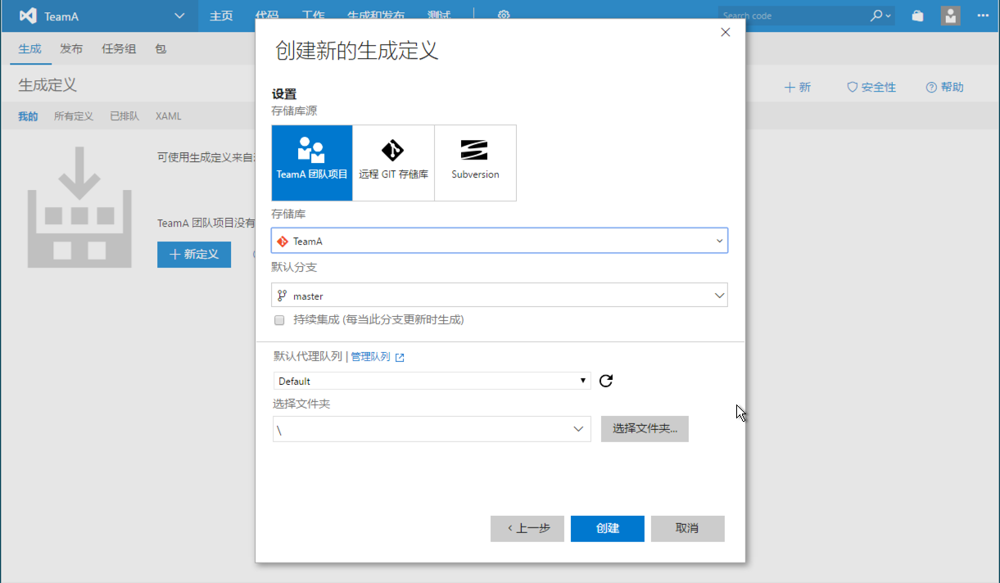

点击 *添加生成步骤...* 并在弹出的步骤列表中找到 *Command Line* 并点击 *添加* 按钮

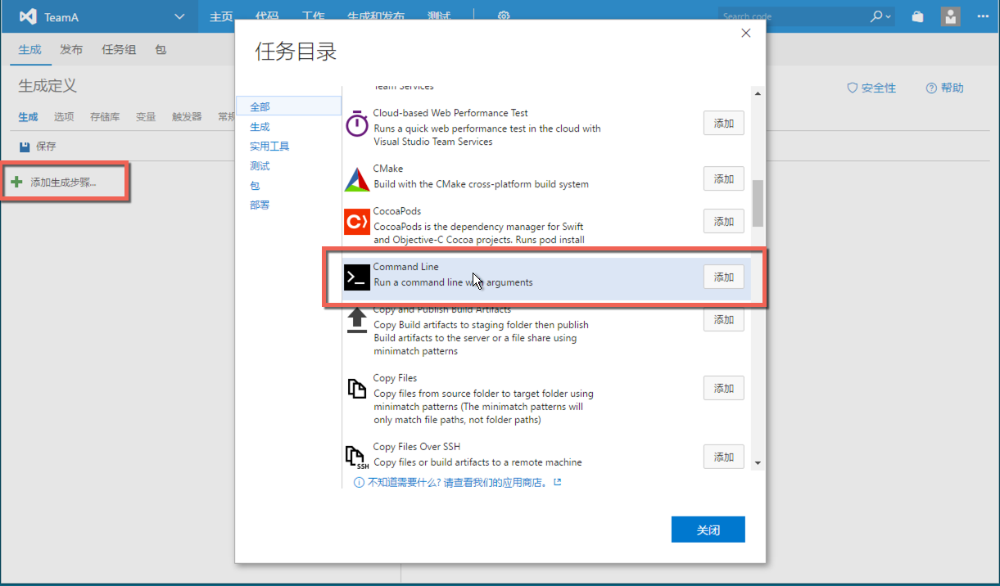

配置生成步骤

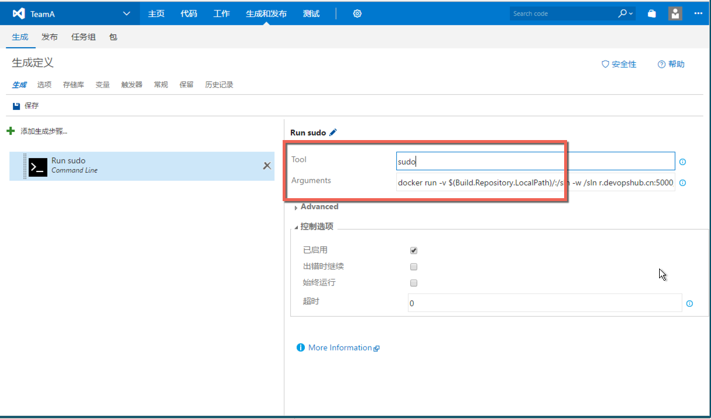

重复以上步骤，创建以下生成步骤

================    ===========
    步骤              命令
================    ===========
步骤1                 docker run -v $(Build.Repository.LocalPath)/:/sln -w /sln r.devopshub.cn:5000/microsoft/aspnetcore-build:1.0.1 sh ./build.sh
步骤2                 docker build $(Build.Repository.LocalPath)/publish/web/ -f $(Build.Repository.LocalPath)/publish/web/Dockerfile -t { 你的景象名称 }:$(Build.BuildNumber)
步骤3                 docker tag { 你的景象名称 }:$(Build.BuildNumber) r.devopshub.cn:5000/{ 你的景象名称 }:$(Build.BuildNumber)
步骤4                 docker push r.devopshub.cn:5000/{ 你的景象名称 }:$(Build.BuildNumber)
================    ===========

点击 *保存* 并命名你的持续集成任务为：{ 你的景象名称 }_CI 

保存后，点击 *为新生成排队* 按钮，并选择讲师指定的 *队列* ，单击 *确定* 启动生成

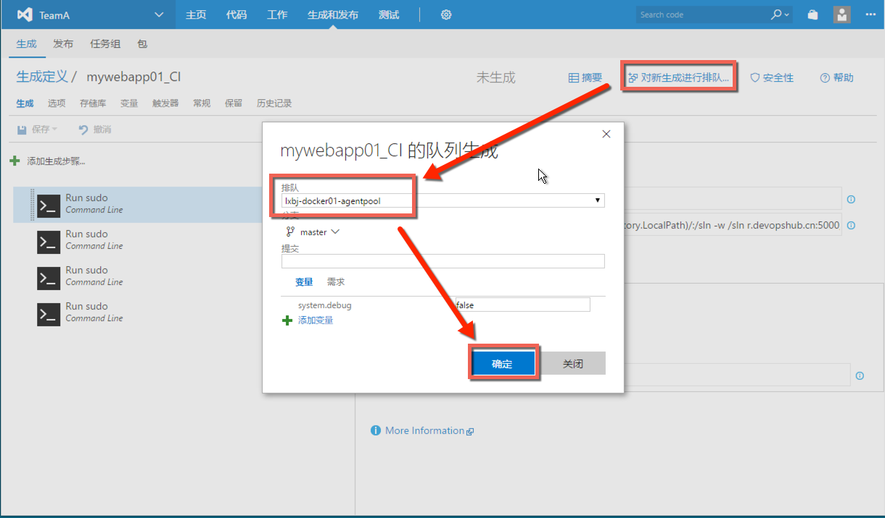

部署应用到Swarm集群
=====================

连接到swarm-master-0节点，运行以下命令

.. code-block:: bash

    docker service create --replicas 1 --name my-server -p 80:80 r.devopshub.cn:5000/{ 你的镜像名称 }：{ 第一个成功的生成id }
    docker service ps my-server

检查服务已经正常启动

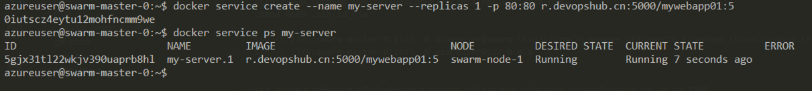

检查服务可以通过浏览器访问

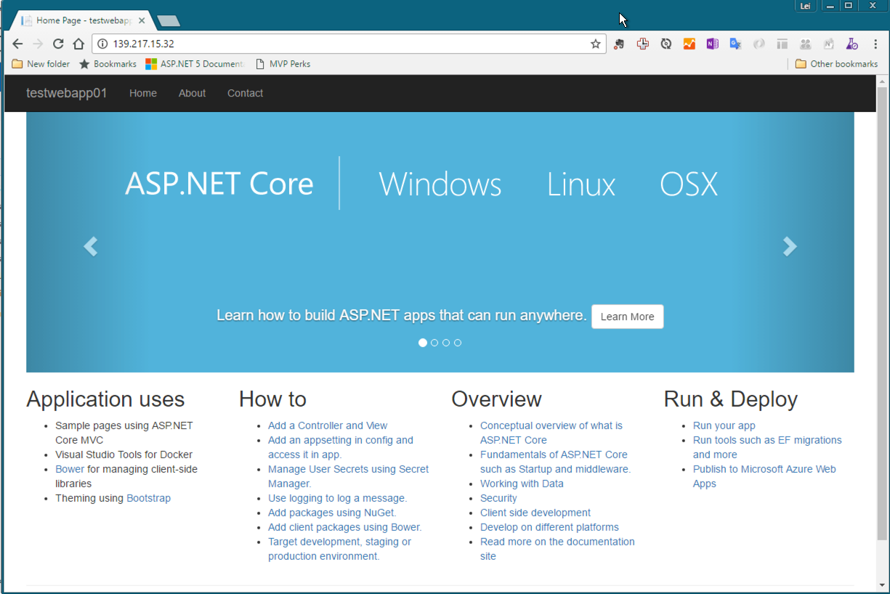

更新持续集成配置进行自动滚动升级
===========================

回到 *生成配置* 页面，并添加以下 远程ssh 任务

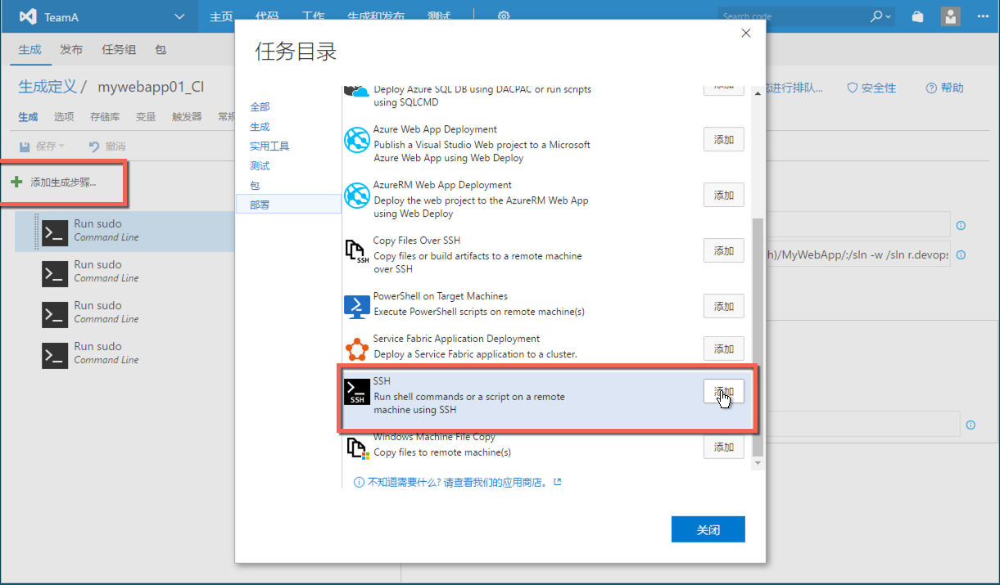

配置 远程ssh任务如下

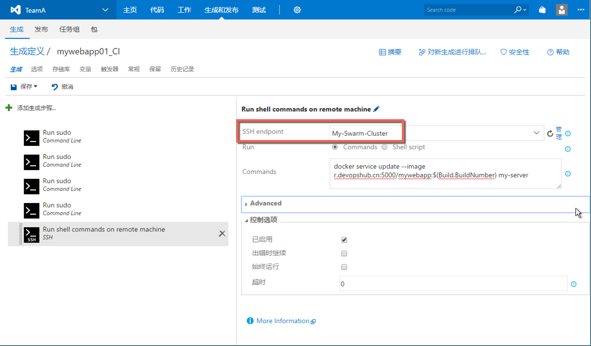

SSH EndPoint 选择之前创建的服务终结点，Commands配置为

.. code-block:: bash 

    docker service update --image r.devopshub.cn:5000/{ 你的镜像名称 }:$(Build.BuildNumber) my-server

更新 *触发器* 为 *持续集成* 模式

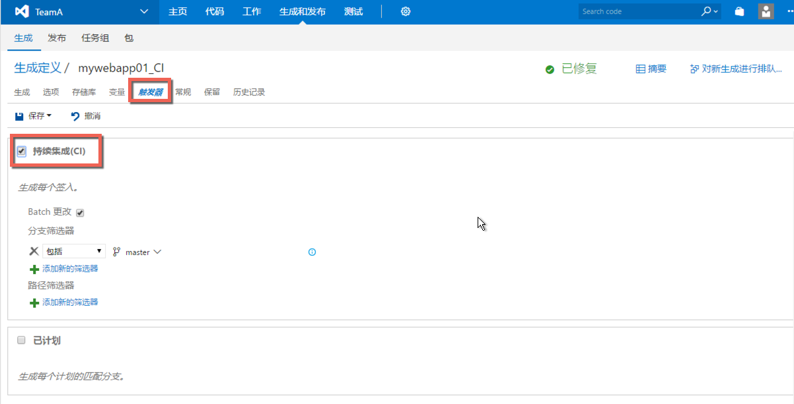

保存配置。

现在，你可以在Visual Studio中对应用程序进行更新，从新推送代码到TFS服务器，持续集成任务会被自动出发并更新Swarm中所运行的实例。你也可以尝试对应用进行伸缩，然后再进行更新。

