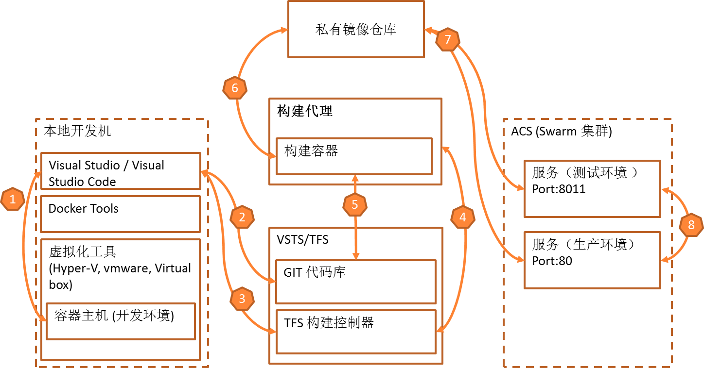

中大型团队：使用VSTS/TFS和Docker Swarm在Azure上搭建DevOps持续发布管道
==========================================================================================

.. |stub-icon| unicode:: U+1F527

.. attention::
    
    文档内容将与Docker v1.12.1保持同步，请确保你所使用的Docker版本与本文档的适用范围一致，再参照本文档进行Docker的安装和配置，以防出现联系过程中系统不对称导致的问题。
    
    
    本文档提供2个主要版本:
    
    - stable: 稳定版本
    - latest: 最新版本，持续更新。

个人开发者或小团队方案
----------------------------

    - 编码并使用本地容器环境进行调试
    - 提交代码到git
    - 开发人员触发CI/CD过程
    - TFS 驱动构建代理执行编译，打包
    - 构建引擎从git获取代码和配置
    - 将容器镜像上传到私有仓库
    - 将容器镜像部署到不同个环境
    - QA/管理人员控制版本升级过程

.. toctree::
   :titlesonly:

   swarm-azure-arm-template-deployment
   swarm-learn-the-basics-of-swarm
   connect-to-tfs-teamproject
   create-continous-integration-job
   create-continous-deployment-pipeline
   