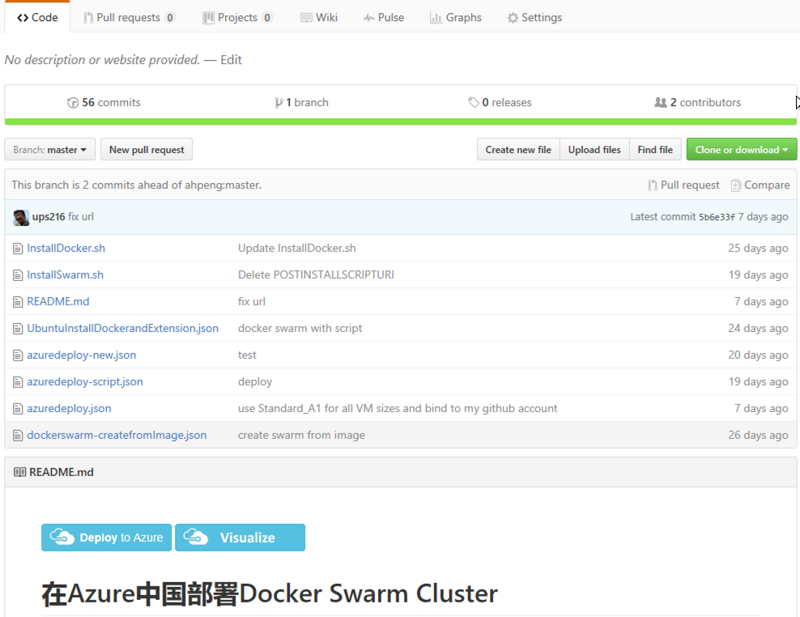
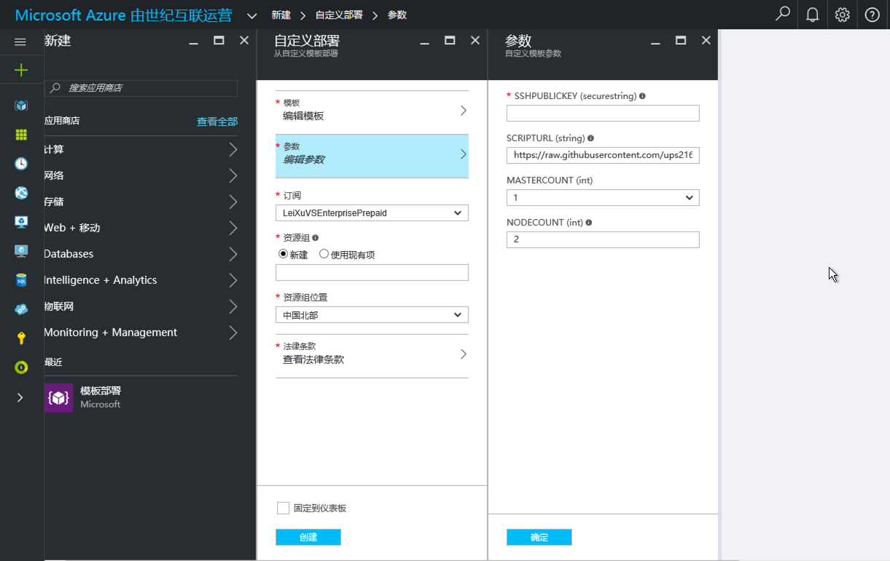
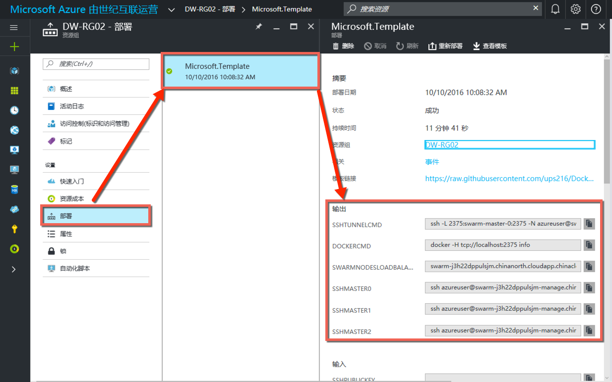
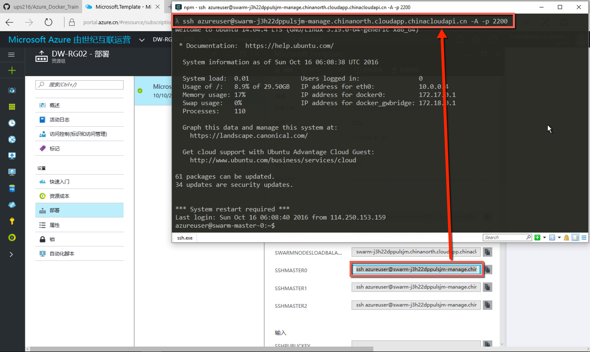
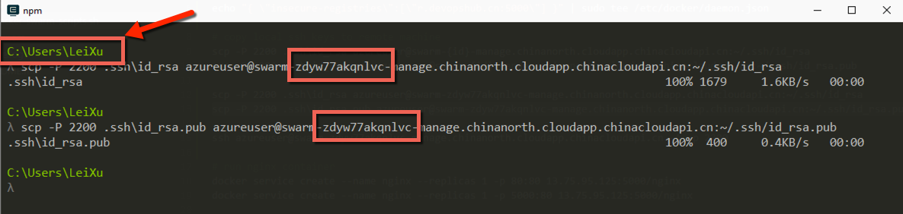
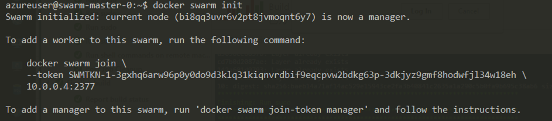
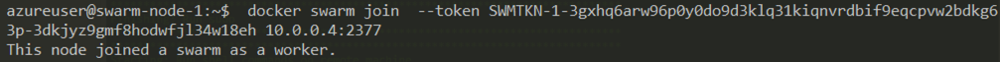
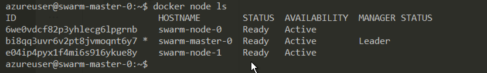
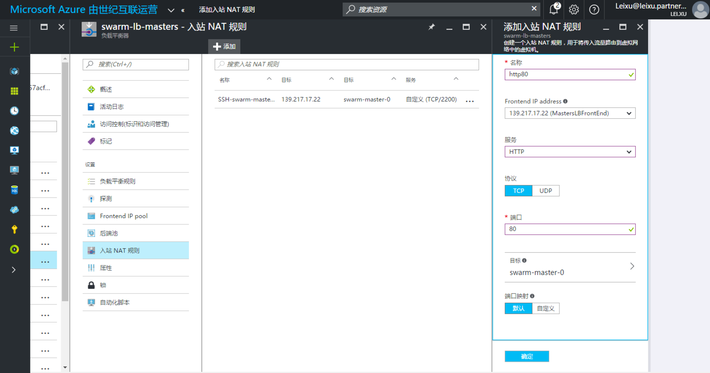

使用Azure资源管理器部署Docker Swarm集群
------------------------------------

什么Azure资源管理器
====================

应用程序的体系结构通常由许多组件构成 – 其中可能包括虚拟机、存储帐户、虚拟网络、Web 应用、数据库、数据库服务器和第三方服务。这些组件不会以独立的实体出现，而是以单个实体的相关部件和依赖部件出现。如果你希望以组的方式部署、管理和监视这些这些组件，那么，你可以使用 Azure 资源管理器以组的方式处理解决方案中的资源。你可以通过一个协调的操作为解决方案部署、更新或删除所有资源。你可以使用一个模板来完成部署，该模板适用于不同的环境，例如测试、过渡和生产。资源管理器提供安全、审核和标记功能，以帮助你在部署后管理资源。

更多信息请参考： `Azure资源管理器概述 <https://www.azure.cn/documentation/articles/resource-group-overview/>`_

Docker Swarm 集群架构
=======================

.. figure:: images/lab02-swarm-cluster-topology.png

Docker Swarm Azure 资源管理器模板
================================

借助Azure资源管理器模板，我们可以很容易的在Azure中部署Docker Swarm集群环境。请从以下地址访问我们的模板

`Docker Swarm Azure资源管理器模板github地址 <https://github.com/ups216/DockerSwarm>`_

部署步骤：

1. 点击此页面中的 Deploy To Azure 按钮，

.. figure:: images/lab02-swarm-deploy-to-azure-button.png

即可启动部署模版。

2. 配置模版参数并启动集群创建过程

点击以上 Deploy to Azure 按钮并使用你的Azure账号登陆系统后，可以看到一下模版配置页面

这里，需要我们输入或者配置一下几个参数

================    ===========
    参数              值
================    ===========
SSHPUBLICKEY         用来管理Swarm集群的ssh公钥
MASTERCOUNT          Swarm集群中管理节点的数量，默认为 1
NODECOUNT            Swarm集群中工作节点的数量，默认为 2
================    ===========

.. attention::
    
    以上我们限制使用了1个管理节点和2个工作节点，这样做时是为了配合试验环境所使用的Azure试用账号的一些限制。实际生产环境中请根据需要配置。
    一般来说，管理节点应为单数并至少是3个，工作节点则可以根据需要配置。

ssh密钥可以使用ssh-keygen这个工具来生成，如果你之前已经在使用ssh密钥来管理服务器请跳过一下生成密钥的步骤。

打开命令行工具，并输入

ssh-keygen -C {emailAddress}

.. attention::

    注意在创建过程中不要设置passpharse，否则后续连接swarm集群的时候可能会走不通。

ssh密钥生成完成后，在命令行中输入

cat ~\.ssh\id_rsa.pub 

并将现实出来的内容全部复制到模版配置页面中的SSHPUBLICKEY字段中。

然后设置“资源组”为新建，输入名称为“docker-swarm-rg01"；点击“法律条款”，并点击”购买“按钮。

最后，勾选“固定到仪表盘”并点击“创建”按钮开始创建swarm集群。整个创建过程大概需要10分钟左右的时间，完成后即可看到一下资源组的资源列表：

.. figure:: images/lab02-swarm-resource-group-overview.png

3. 连接到swarm集群

使用Azure资源管理器模版创建完成swarm集群后，我们可以通过“部署”输出内容获取集群访问地址，点击一下页面中的 * 部署 | Microsoft.Template * 进入模版输出页面：

复制 SSHMASTER0 的内容，并粘贴到命令行工具中，即可连接至swarm集群的管理节点（master0）

4. 配置Swarm Master 0节点作为整个集群的SSH管理服务器

启动另外一个令另行窗口，确保处于当前用户的根目录中，并执行以下命令将ssh密钥复制到 MASTER-0 节点上，注意请替换以下{id}部分为你的集群id

.. code-block:: bash

    scp -P 2200 .ssh\id_rsa azureuser@swarm-{id}-manage.chinanorth.cloudapp.chinacloudapi.cn:~/.ssh/id_rsa
    scp -P 2200 .ssh\id_rsa.pub azureuser@swarm-{id}-manage.chinanorth.cloudapp.chinacloudapi.cn:~/.ssh/id_rsa.pub

复制完成后，回到已经登陆到 MASTER-0 节点的SSH session中，测试以下命令可以正常执行

.. code-block:: bash
    
    chmod 0600 .ssh/id_rsa
    ssh swarm-node-0
    exit
    ssh swarm-node-1
    exit

.. attention::

    因为我们只将SSH密钥复制到了MASTER-0节点，所以我们只能从MASTER-0节点分别登陆到其他节点，如果从NODE-0到NODE-1是无法登陆的。如果希望可以在任何节点互相登陆则需要将SSH密钥复制到所有节点中。

5. 启动 SWARM 集群

在 MASTER-0 节点上运行以下命令，初始化SWARM集群

.. code-block:: bash
    
    docker swarm init 

将以上命令的输出复制，然后使用刚才配置好的ssh连接分别登录到swarm-node-0和swarm-node-1上面分别执行。

完成后，回到swarm-master-0节点，输入一下命令

.. code-block:: bash

    docker node ls

如果以上命令可以输入类似一下的输出，则表示我们的swarm集群已经配置成功。

6. 在 Swarm 集群上添加80端口的NAT入站规则

按照下图配置80端口入站规则，并指向swarm-master-0

