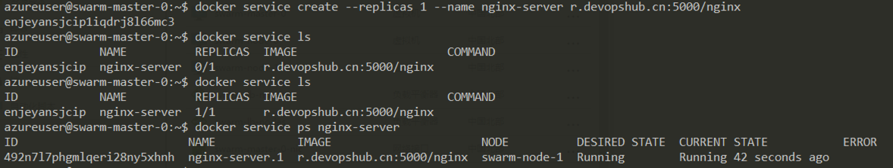
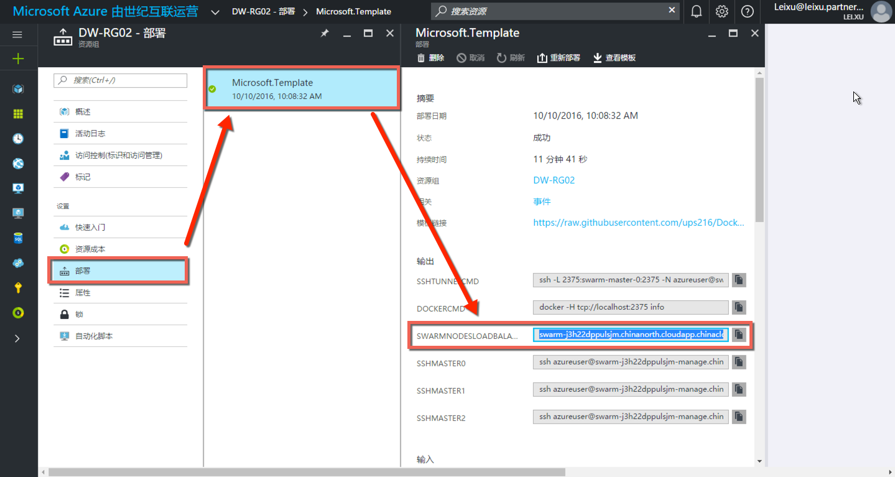
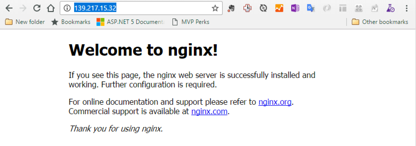
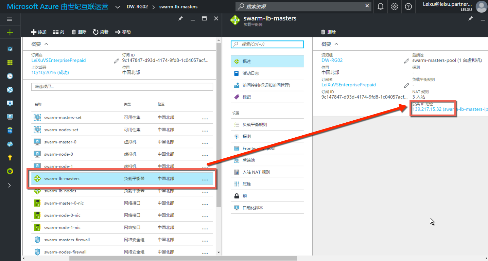
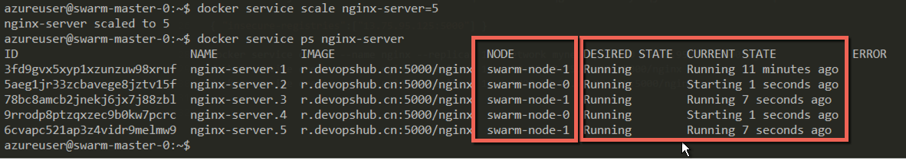
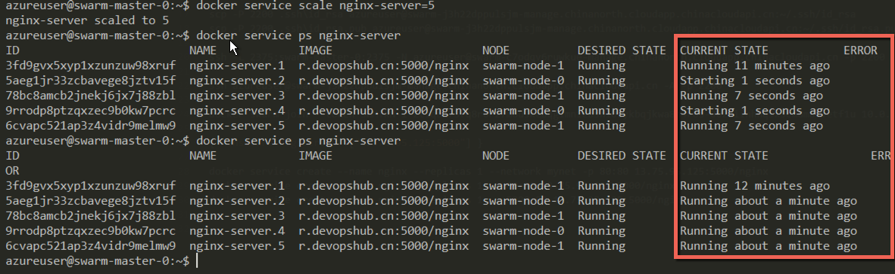
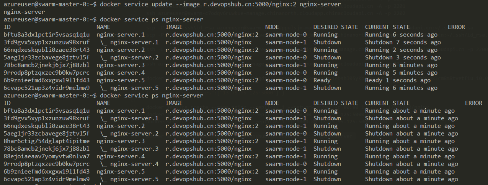
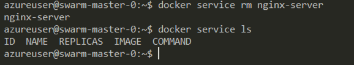

学习 docker swarm 的基本操作
------------------------

在Docker Swarm中，我们使用服务（Service）来管理所部属的内容，使用一下命令尝试在你所新建的docker swarm集群中部署nginx服务。

1. 启动nginx服务

.. code-block:: bash

    docker service create --replicas 1 --name nginx-server -p 80:80 r.devopshub.cn:5000/nginx 

================    ===========
    参数              说明
================    ===========
--replicas           运行服务的节点数（后续我们将通过此参数扩展／收缩服务节点）
--name               服务名称，用来获取服务状态和管理服务，如：扩展／收缩，停止，更新，删除等。
-p                   我们将容器的80端口暴露给swarm集群的80端口
nginx                所使用的服务docker 镜像名称，注意这里我们使用了 r.devopshub.cn:5000 这个私有仓库作为获取地址
================    ===========

然后运行以下命令获取服务运行状态

.. code-block:: bash

    docker service ls
    docker service ps nginx-server 

运行结果如下：

注意以上第一次运行docker service ls的时候，replicas这里显示的0/1。因为拉取镜像需要一定的时间，所以这时服务还没有被成功部署。

2. 通过Azure负载均衡节点访问服务

通过 Azure 门户获取集群的DNS地址

将此地址复制到浏览器中，即可看到nginx已经在运行

如果无法通过DNS地址访问，有可能是DNS更新不及时造成的；这时也可以通过在Azure门户中找到负载均衡器ip的方式访问

3. 扩展／收缩服务节点

在 swarm-master-0节点上运行以下命令，将nginx-server的服务扩展为5个节点

.. code-block:: bash

    docker service scale nginx-server=5

完成后运行以下命令查看节点部署情况

.. code-block:: bash
    
    docker service ps nginx-server

稍等几分钟再次运行此命令，直到所有节点均为运行状态

现在我们有5个节点正在运行nginx-server这里服务了。

4. 进行滚动升级

在 swarm-master-0节点上运行以下命令，升级nginx-server服务到版本2

.. code-block:: bash

    docker service update --image r.devopshub.cn:5000/nginx:2 nginx-server 

完成后运行以下命令查看节点部署状态

.. code-block:: bash
    
    docker service ps nginx-server

可以多运行几次这个命令，直到所有节点升级完成

5. 删除服务

在 swarm-master-0节点上运行以下命令，删除nginx-server服务

.. code-block:: bash
    
    docker service rm nginx-server

完成后运行以下命令查看状态

.. code-block:: bash
    
    docker service ls

.. attention::

    请确保nginx-server服务被成功删除，因为后的试验中我们还将使用80端口暴露服务；如果不删除此服务会造成端口冲突而无法启动服务。

