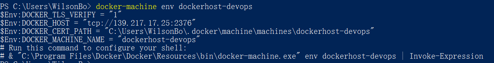

在Azure Docker Host上创建Registry报错
-------------------------------------

.. attention::
    
    文档内容将与Docker v1.12.1保持同步，请确保你所使用的Docker版本与本文档的适用范围一致，再参照本文档进行Docker的安装和配置，以防出现联系过程中系统不对称导致的问题。

错误详细信息
~~~~~~~~~~~~~~~~~~~~~~~~~~~~~~~~

.. code-block:: text

    Network timed out while trying to connect to https://index.docker.io/v1/repositories/microsoft/aspnetcore/images	

解决方案
~~~~~~~~~~~~~~~~~~~~~~~~~~~~~~~~~~~~~~~~~~~~~~~~
依次运行如下脚本：

.. code-block:: text

    docker-machine ls
    docker-machine ssh {azure docker host name}
    sudo vi /etc/default/docker

取消如下显示代码的注释：

.. code-block:: text

    DOCKER_OPTS="--dns 8.8.8.8 --dns 8.8.4.4"

.. attention::
    
    在power shell中编辑文本文件操作比较麻烦， 具体操作步骤如下：
    * 运行sudo vi 后，如果没有显示文本内容，而是vi命令提示的话，按 **e**
    * 使用空格定位到上面文本的行
    * 按 **a**, 这时power shell下方会有一个 **INSERT** 提示，如果没出现提示就再按 **a**
    * 按 **Backspace** 删除 # 号
    * 注意上面文本中的开头字母D也会被删除， 输入 **D**
    * 输入Ctrl + C
    * 输入Shift + w,q
    * 输入wq!

在power shell中继续依次运行如下脚本：

.. code-block:: text

    docker-machine ls
    docker-machine restart {azure docker host name}
    docker-machine env {azure docker host name}

最后的命令会刷新本地docker-machine的环境变量，运行结果应该类似下面显示：

