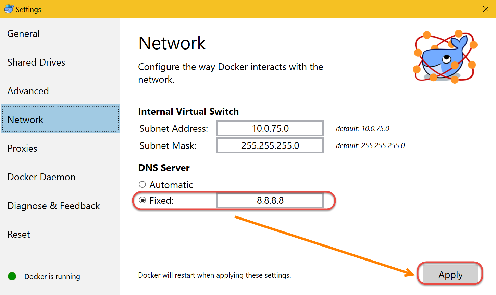

在Visual Studio中调试.Net Core Web Application报错：Network timed out
----------------------------------

.. attention::
    
    文档内容将与Docker v1.12.1保持同步，请确保你所使用的Docker版本与本文档的适用范围一致，再参照本文档进行Docker的安装和配置，以防出现联系过程中系统不对称导致的问题。

错误详细信息
~~~~~~~~~~~~~~~~~~~~~~~~~~~~~~~~

.. code-block:: text

    错误	MSB4018	“PrepareForLaunch”任务意外失败。
    Microsoft.DotNet.Docker.CommandLineClientException: Creating network "webindocker_default" with the default driver
    Building webindocker
    Service 'webindocker' failed to build: Network timed out while trying to connect to https://index.docker.io/v1/repositories/microsoft/aspnetcore/images. You may want to check your internet connection or if you are behind a proxy.
    at System.Runtime.CompilerServices.TaskAwaiter.ThrowForNonSuccess(Task task)
    at System.Runtime.CompilerServices.TaskAwaiter.HandleNonSuccessAndDebuggerNotification(Task task)
    at System.Runtime.CompilerServices.TaskAwaiter.ValidateEnd(Task task)
    at Microsoft.DotNet.Docker.BuildTasks.PrepareForLaunch.<ExecuteAsync>d__0.MoveNext()
    --- End of stack trace from previous location where exception was thrown ---
    at System.Runtime.CompilerServices.TaskAwaiter.ThrowForNonSuccess(Task task)
    at System.Runtime.CompilerServices.TaskAwaiter.HandleNonSuccessAndDebuggerNotification(Task task)
    at Microsoft.DotNet.Docker.BuildTasks.DockerBaseTask.Execute()
    at Microsoft.Build.BackEnd.TaskExecutionHost.Microsoft.Build.BackEnd.ITaskExecutionHost.Execute()
    at Microsoft.Build.BackEnd.TaskBuilder.<ExecuteInstantiatedTask>d__26.MoveNext()	C:\Wilson\temp\delete\azure_training\webInDocker\webInDocker.xproj	C:\Program Files (x86)\MSBuild\Microsoft\VisualStudio\v14.0\DotNet\Microsoft.DotNet.Publishing\ImportAfter\Microsoft.DotNet.Docker.targets	70	

解决方案
~~~~~~~~~~~~~~~~~~~~~~~~~~~~~~~~~~~~~~~~~~~~~~~~
本地托盘程序中右键打开Docker设置界面，将DNS设置改为Fixed: 8.8.8.8。

重新按F5调试程序。

